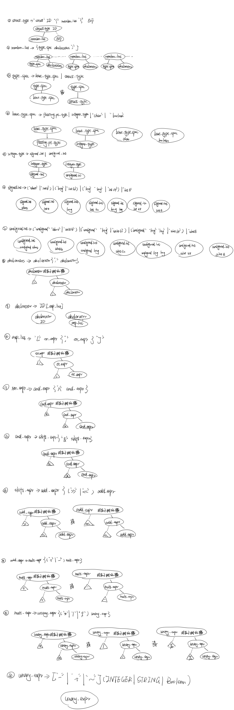

# 编译原理-语法分析MIDL

2018303252 邹荧双

[toc]

## MIDL词法规则

### 关键字

<table border="1">
<tr>
  <td>struct</td>
  <td>float</td>
  <td>boolean</td>
  <td>short</td>
  <td>long</td>
</tr>
<tr>
  <td>double</td>
  <td>int8</td>
  <td>int16</td>
  <td>int32</td>
  <td>int64</td>
</tr>
<tr>
  <td>uint8</td>
  <td>int16</td>
  <td>int32</td>
  <td>int64</td>
  <td>char</td>
</tr>
  <tr>
  <td>unsigned</td>
  <td></td>
  <td></td>
  <td></td>
  <td></td>
</tr>
</table>

### 专用符号

<table border="1">
<tr>
  <td>{</td>
  <td>}</td>
  <td>;</td>
  <td>[</td>
  <td>]</td>
</tr>
<tr>
  <td>*</td>
  <td>+</td>
  <td>-</td>
  <td>~</td>
  <td>/</td>
</tr>
<tr>
  <td>%</td>
  <td>>></td>
  <td><<</td>
  <td>&</td>
  <td>^</td>
</tr>
  <tr>
  <td>|</td>
  <td>,</td>
  <td></td>
  <td></td>
  <td></td>
</tr>
</table>

### 标识符ID

ID = LETTER (UNDERLINE?( LETTER | DIGIT))*

### 整数INTEGER

INTEGER = (0 | [1-9] [0-9]*) INTEGER_TYPE_SUFFIX?

### 字符串STRING（可以转义）

STRING =  " (ESCAPE_SEQUENCE |  (~\ | ~") )*  "

### BOOLEAN

BOOLEAN = TRUE | FALSE

### 其他

LETTER = [a-z] | [A- Z]

DIGIT = [0-9]

UNDERLINE= _

INTEGER_TYPE_SUFFIX = l | L

ESCAPE_SEQUENCE = \ ( b | t | n | f | r |  " | \ )

## MIDL语法规则

1. struct_type->“struct” ID “{” member_list “}”EOF

2. member_list-> { type_spec declarators “;” }

3. type_spec -> base_type_spec | struct_type

4. base_type_spec->floating_pt_type|integer_type| “char” | “boolean”

5. floating_pt_type -> “float” | “double” | “long double”

6. integer_type -> signed_int | unsigned_int

7. signed_int->(“short”|“int16”)

   |(“long”|“int32”)

   |(“long” “long”|“int64”)

   |“int8”

8. unsigned_int -> (“unsigned”“short”| “unit16”)

   | (“unsigned”“long”| “unit32”)

   | (“unsigned” “long” “long” | “unit64”)

   | “unit8”

9. declarators -> declarator {“,” declarator }
10. declarator -> ID [ exp_list ]
11. exp_list -> “[” or_expr { “,”or_expr } “]”
12. or_expr -> xor_expr {“|” xor_expr }
13. xor_expr -> and_expr {“^” and_expr }
14. and_expr -> shift_expr {“&”shift_expr }
15. shift_expr -> add_expr { (“>>” | “<<”) add_expr }
16. add_expr -> mult_expr { (“+” | “-”) mult_expr
17. mult_expr -> unary_expr { (“*” |“/”|“%”) unary_expr }
18. unary_expr -> [“-”| “+” | “~”] ( INTEGER | STRING | BOOLEAN )

### 抽象语法分析树

### 测试

1. 只需调用Parser类的Run函数，函数内为输入文件的名（去掉.txt），如下图所示：

   

   注：因为使用clion可执行文件位于cmake-build-debug文件夹，因此此时的test文件夹在上级目录，也可以使用绝对路径。

2. 测试文件的输出，如下图所示：

   

   注：其中后缀为paser_error.txt的文件为语法分析的错误输出，scanner_error.txt文件为词法分析的输出，syntax_tree.txt文件为抽象语法树的输出，tokens.txt的文件为词法分析tokens的输出。

3. 该语法分析使用鸵鸟政策，如遇到了语法错误将会继续执行，直到文件截止。