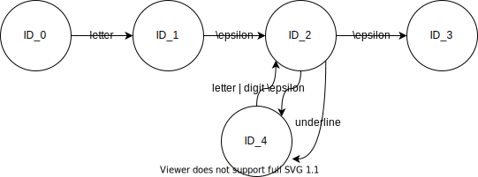
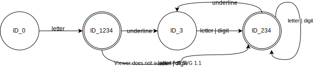
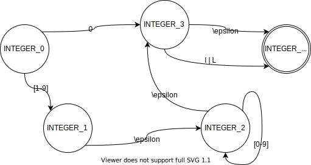
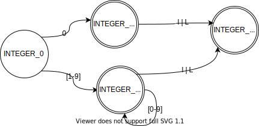
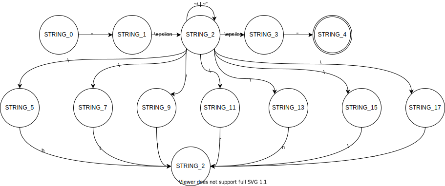
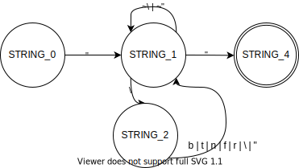
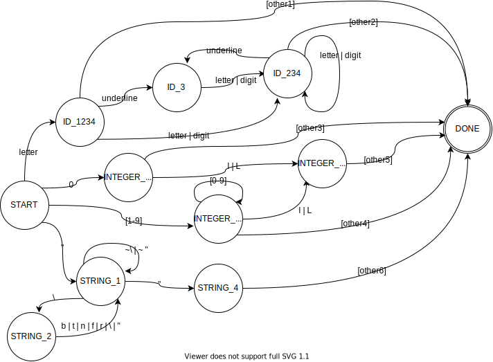

# 编译原理-词法分析MIDL

<p align="right">2018303252 邹荧双</p>

[toc]

## MIDL词法规则

### 关键字

<table border="1">
<tr>
  <td>struct</td>
  <td>float</td>
  <td>boolean</td>
  <td>short</td>
  <td>long</td>
</tr>
<tr>
  <td>double</td>
  <td>int8</td>
  <td>int16</td>
  <td>int32</td>
  <td>int64</td>
</tr>
<tr>
  <td>uint8</td>
  <td>int16</td>
  <td>int32</td>
  <td>int64</td>
  <td>char</td>
</tr>
  <tr>
  <td>unsigned</td>
  <td></td>
  <td></td>
  <td></td>
  <td></td>
</tr>
</table>

### 专用符号

<table border="1">
<tr>
  <td>{</td>
  <td>}</td>
  <td>;</td>
  <td>[</td>
  <td>]</td>
</tr>
<tr>
  <td>*</td>
  <td>+</td>
  <td>-</td>
  <td>~</td>
  <td>/</td>
</tr>
<tr>
  <td>%</td>
  <td>>></td>
  <td><<</td>
  <td>&</td>
  <td>^</td>
</tr>
  <tr>
  <td>|</td>
  <td>,</td>
  <td></td>
  <td></td>
  <td></td>
</tr>
</table>

### 标识符ID

ID =  LETTER (UNDERLINE?( LETTER | DIGIT))*

### 整数INTEGER

INTEGER = (0 | [1-9] [0-9]*) INTEGER_TYPE_SUFFIX?

### 字符串STRING（可以转义）

STRING =  " (ESCAPE_SEQUENCE |  (~\ | ~") )*  " 

### BOOLEAN

BOOLEAN =  TRUE | FALSE

### 其他

LETTER = [a-z] | [A- Z]

DIGIT = [0-9]

UNDERLINE= _

INTEGER_TYPE_SUFFIX =  l | L

ESCAPE_SEQUENCE =  \ ( b | t | n | f | r |  " | \ )

## 状态转换图

### ID =  LETTER (UNDERLINE?( LETTER | DIGIT))*

#### NFA



#### 转换过程

|        | letter | Digit | underline |
| ------ | ------ | ----- | --------- |
| {0}    | {1234} |       |           |
| {1234} | {234}  | {234} | {3}       |
| {234}  | {234}  | {234} | {3}       |
| {3}    | {234}  | {234} |           |

#### DFA



### INTEGER = (0 | [1-9] [0-9]*) INTEGER_TYPE_SUFFIX?

#### NFA



#### 转换过程

|        | 0     | [1-9]  | l    | L    |
| ------ | ----- | ------ | ---- | ---- |
| {0}    | {34}  | {1234} |      |      |
| {1234} | {234} | {234}  | {4}  | {4}  |
| {34}   |       |        | {4}  | {4}  |
| {4}    |       |        |      |      |

#### DFA



### STRING =  " (ESCAPE_SEQUENCE |  (~\ | ~") )*  " 

#### NFA

注：下面的STIRNG_2与下文的STRING_2是同一个状态，因为话



#### 转换过程

|                     | "     | \                   | b\|t\|n\|f\|r | ~"\|~\ |
| ------------------- | ----- | ------------------- | ------------- | ------ |
| {0}                 | {123} |                     |               |        |
| {123}               | {4}   | {5,7,9,11,13,15,17} |               | {123}  |
| {5,7,9,11,13,15,17} | {123} | {123}               | {123}         |        |
| {4}                 |       |                     |               |        |

#### DFA



### 总体状态转换图



其中：

[other1]为空白符、符号或者非下划线、非数字、非字母

[other2]为空白符、专用符号或者非下划线、非数字、非字母

[other3]为空白符，专用符号、字母或者非数字，且非l或者L

[other4]为空白符，专用符号、字母或者非数字，且非l或者L

[other5]为空白符、专用符号、字母、数字等

[other6]为空白符、专用符号、字母、数字等

#### 解释说明：

1. 测试的输出文件在./test/result文件夹中，且后缀为scanner_error的为寻找到的错误，后缀为tokens的为输出的token；

2. 对于例如0123，0l0的测试输入，将都会判别为INTEGER INTERGER和INTEGER INTERGER，在词法分析中不判断错误，将会送至语法分析再次判别；

3. 对于例如123a的输入，将会判别为INTERGER ID，在词法分析中不判断错误，将会送至语法分析再次判别；

4. 将对于如下的string测试样例，采用常见的编译器处理方法：不允许STRING跨行处理。

   ```
   “sfsdf
   "dfa"
   sdfas"
   ```

   将会判别为第一行以及第三行出现错误。

## 测试方案

### INTEGER


说明：

1. 0l0 判别为INTEGER INTERGER，在词法分析中不判断错误，将会送至语法分析再次判别；
2. 0123判别为INTEGER INTERGER，在词法分析中不判断错误，将会送至语法分析再次判别；
3. 0_34识别underline退出INTEGER，并且重新开始识别，但无underline开始的状态所以出错；识别34满足INTEGER，所以为 INTEGER INTERGER。
4. 34_0识别underline退出INTEGER，并且重新开始识别，但无underline开始的状态所以出错；识别4满足INTEGER，所以为 INTEGER INTERGER。
5. 123a判别为INTEGER ID，在词法分析中不判断错误，将会送至语法分析再次判别；
6. 0123a判别为INTEGER INTEGER ID，在词法分析中不判断错误，将会送至语法分析再次判别；

错误输出：

```
../test/zys_test_integer:4:2 error: "_", incorrect morphology!
../test/zys_test_integer:5:3 error: "_", incorrect morphology!
```

### ID


说明：

1. asd_ 识别到换行符，不满足该状态需要识别的letter或者digit，抛出错误；
2. 12_4识别underline退出INTEGER，并且重新开始识别，但无underline开始的状态所以出错；识别4满足INTEGER，所以为 INTEGER INTERGER。
3. _dfa 识别到underline，但是无underline开始的状态，抛出错误；重新开始，dfa满足ID的状态转换输出ID

错误输出：

```
../test/zys_test_id:7:5 error: "
", before, has incorrect definition morphology!
../test/zys_test_id:10:3 error: "_", incorrect morphology!
../test/zys_test_id:11:1 error: "_", incorrect morphology!
```

### STRING


说明：

1. "\\\\\a"识别到第三个\后识别a，因为不满足状态转换的条件，出错；
2. "dfa 识别到换行符，但当前状态未结束，抛出错误。
3. asdfa"识别到asdfa后，识别到“，ID状态结束，输出ID；识别到“，后识别到换行符，但当前状态未结束，抛出错误。
4. \ 在开始状态，错误的状态转换条件
5. \\\ 在开始状态，错误的状态转换条件

错误输出：

```
../test/zys_test_string:1:5 error: "a", before, has incorrect definition morphology!
../test/zys_test_string:1:7 error: "
", before, has incorrect definition morphology!
../test/zys_test_string:5:5 error: "
", before, has incorrect definition morphology!
../test/zys_test_string:7:7 error: "
", before, has incorrect definition morphology!
../test/zys_test_string:10:1 error: "\", incorrect morphology!
../test/zys_test_string:11:1 error: "\", incorrect morphology!
../test/zys_test_string:11:2 error: "\", incorrect morphology!
../test/zys_test_string:12:1 error: "\", incorrect morphology!
```

### BOOLEAN


说明：

1. 根据BOOLEAN的正则表达式，BOOLEAN只满足于TURE和FALSE（都为大写），且小写true和false都不是关键字，因此都识别为ID。

### ALL


说明：

1. float _ a1; float识别为FLOAT，_a1;为underline开头，错误的状态转换条件，抛出错误；a1; 为ID 和 SEMICOLON；
2. long a00009_ ;  其中a00009_；识别为ID；underline开头，错误的状态转换条件，抛出错误；和SEMICOLON；
3. "dfa 识别到换行符，但当前状态未结束，抛出错误。
4. ''，错误的状态转换条件，抛出错误。

错误输出：

```
../test/zys_test_all:2:12 error: "_", incorrect morphology!
../test/zys_test_all:4:25 error: ";", before, has incorrect definition morphology!
../test/zys_test_all:11:5 error: "
", before, has incorrect definition morphology!
../test/zys_test_all:14:1 error: "'", incorrect morphology!
../test/zys_test_all:14:2 error: "'", incorrect morphology!
```

